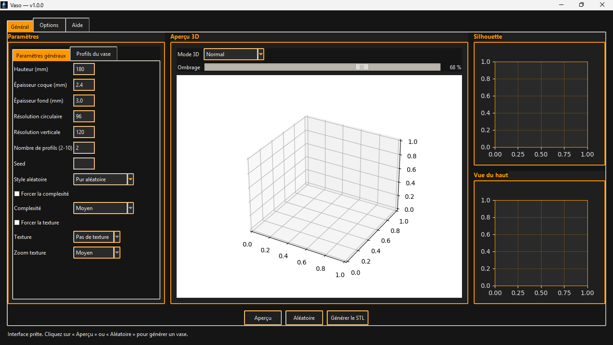
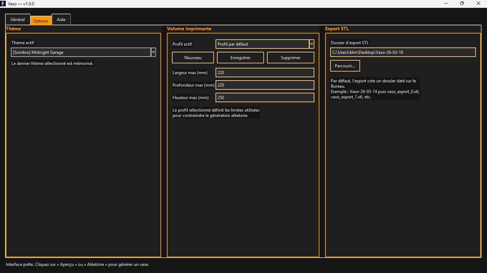
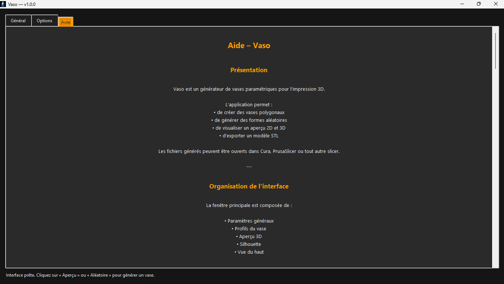
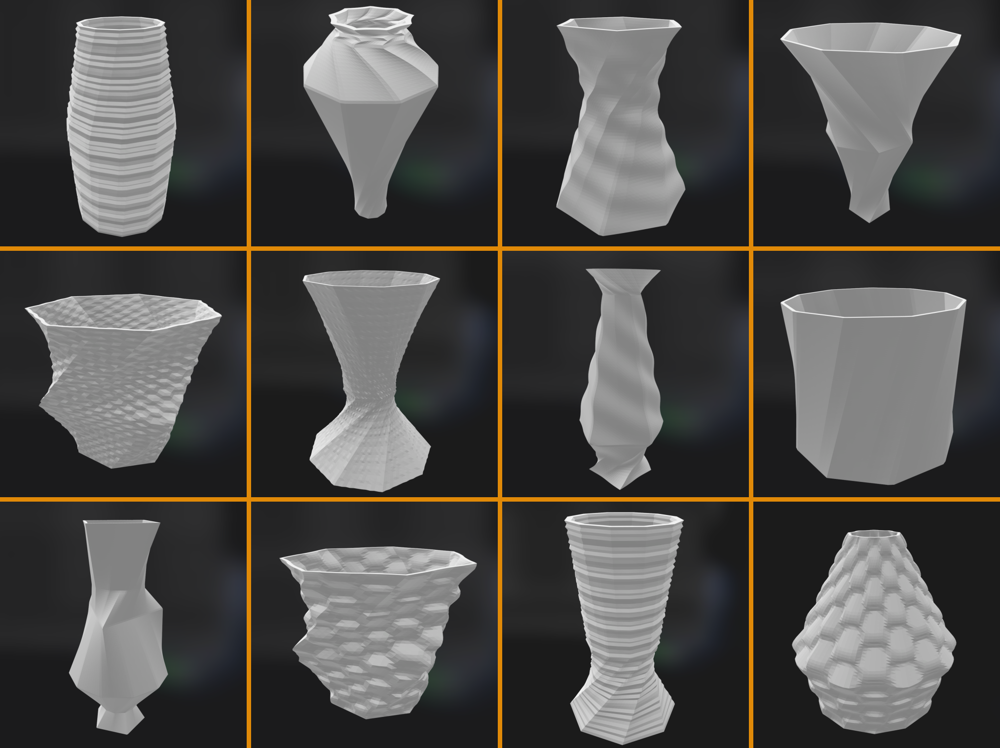

# Vaso

**Vaso** est un générateur de vases polygonaux écrit en **Python**.

Le programme permet de créer des vases à partir de profils polygonaux interpolés verticalement, de générer un maillage triangulé, puis d’exporter le modèle au format **STL** pour l’impression 3D.

---

## 👁️ Aperçu

  
  
  




---

# 📥 Téléchargement

## 💾 Applications standalone (recommandé)

Les versions compilées sont disponibles dans les **Releases GitHub** :

https://github.com/mrklm/vaso/releases

- 🐧 **Linux**
  - [Vaso-v1.0.0-linux-x86_64](https://github.com/mrklm/vaso/releases)
  
  
- 🍎 **macOS**
  - [Vaso-v1.0.0-macOS-x86_64.dmg](https://github.com/mrklm/vaso/releases)

- 🪟 **Windows**  
  - [Vaso-v1.0.0-windows-x86_64.zip](https://github.com/mrklm/vaso/releases)


Chaque release inclut également un fichier **SHA256** permettant de vérifier l’intégrité des fichiers téléchargés.

---

# ✨ Fonctionnalités

- définition de **2 à 10 profils squelettes polygonaux**
- réglage pour chaque profil :
  - diamètre
  - nombre de côtés
  - rotation
  - position verticale
- interpolation entre profils
- génération d’un **maillage triangulé**
- export en **STL**
- textures paramétriques
- génération **aléatoire contrôlée**
- aperçu **2D + 3D**
- interface graphique **Tkinter**

---

# 🎲 Génération aléatoire

Vaso peut générer automatiquement des formes variées.

Les paramètres suivants peuvent être contrôlés :

- **style de génération**
- **niveau de complexité**
  - sobre
  - moyen
  - complexe
- **texture**
- **zoom de texture**

La génération utilise une **seed** permettant de reproduire exactement une forme.

---

# 🏗️ Structure du projet

```
vaso
├─ app.py
├─ generator.py
├─ model.py
├─ exporter.py
├─ assets/
│  ├─ vaso.png
│  ├─ vaso.ico
│  ├─ vaso.icns
│  └─ aide.md
├─ screenshots/
├─ requirements.txt
├─ README.md
```

### Fichiers principaux

| fichier | rôle |
|------|------|
| `app.py` | interface graphique et logique principale |
| `generator.py` | génération géométrique et maillage |
| `model.py` | structures de données |
| `exporter.py` | export STL |

---

# 🧪 Installation depuis le code source

## 1. Cloner le projet

```bash
git clone https://github.com/mrklm/vaso.git
cd vaso
```

---

## 2. Créer un environnement virtuel

### Linux / macOS

```bash
python3 -m venv .venv
source .venv/bin/activate
```

### Windows

```powershell
python -m venv .venv
.venv\Scripts\activate
```

---

## 3. Installer les dépendances

```bash
pip install -r requirements.txt
```

---

## 4. Lancer l’application

```bash
python app.py
```

---

# 🧱 Build des applications

Le projet fournit des scripts de build pour chaque plateforme.

---

## 🪟 Windows

```powershell
.\build-windows.ps1
```

Génère :

```
releases/
Vaso-vX.X.X-windows-x86_64.zip
```

---

## 🐧 Linux

```bash
./build-linux.sh
```

Génère :

```
releases/
Vaso-vX.X.X-linux-x86_64.tar.gz
Vaso-vX.X.X-linux-x86_64.AppImage
```

---

## 🍎 macOS

```bash
./build-macos.sh
```

Génère :

```
releases/
Vaso-vX.X.X-macOS-arm64.dmg
```

---

# 🧠 Technologies utilisées

- Python
- Tkinter
- NumPy
- Matplotlib
- Trimesh
- PyInstaller

---

# 📜 Licence

Projet open source.


